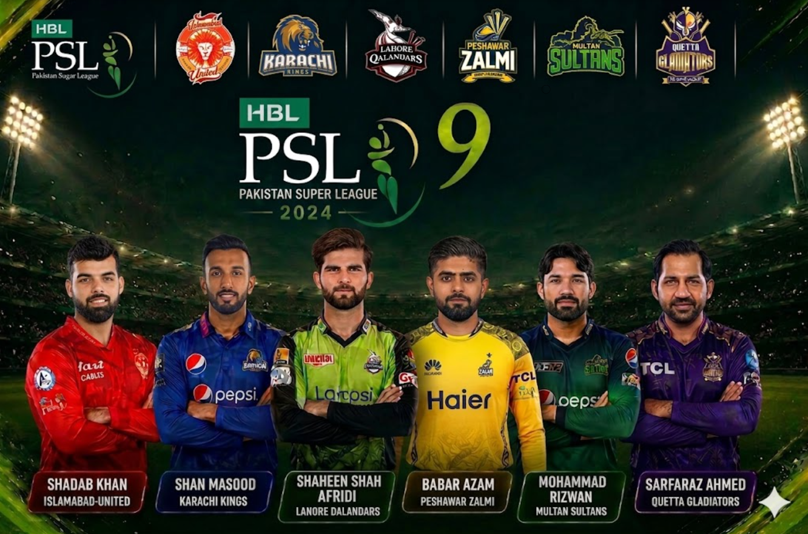
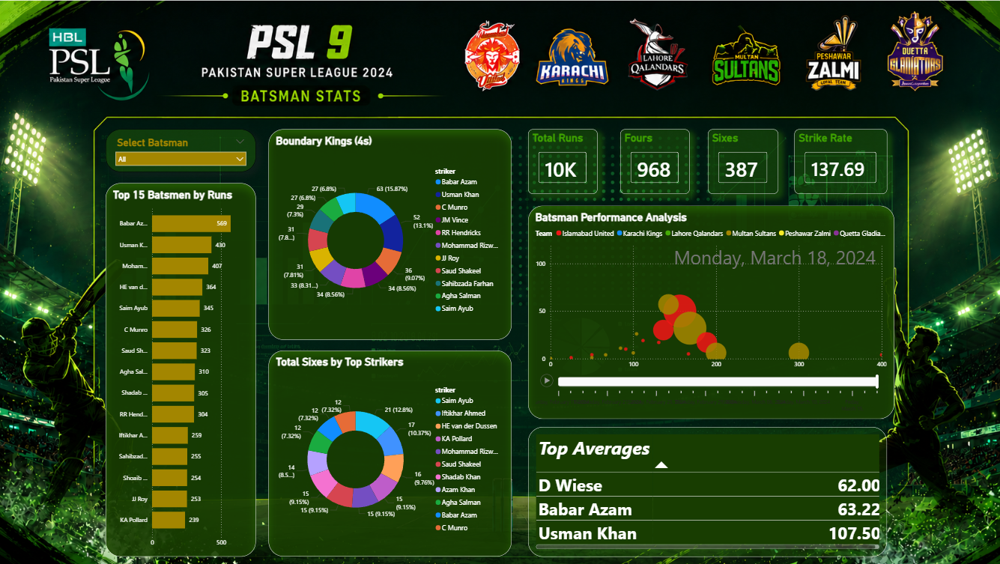
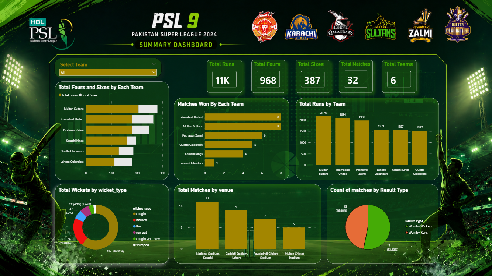
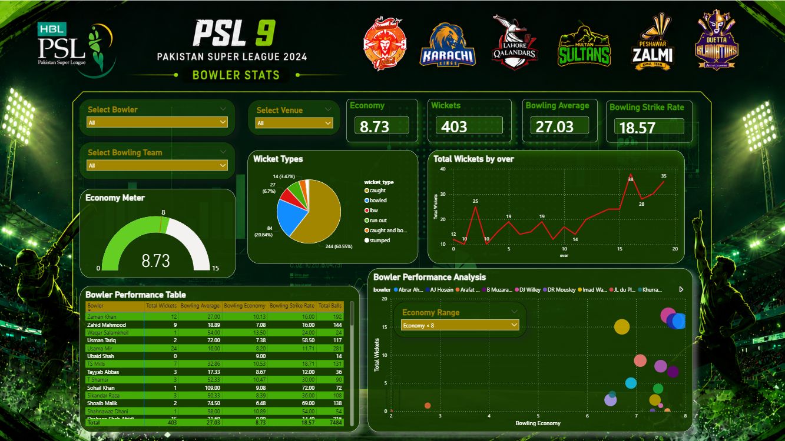

# 🏏 PSL 9 Sports Analytics Dashboard | Power BI


> An interactive Power BI dashboard that analyzes **Pakistan Super League (PSL) Season 9** batting, bowling, team, and tournament statistics using business intelligence techniques.

---

## 📌 Project Overview

The **PSL 9 Sports Analytics Dashboard** is an end-to-end Business Intelligence project built using **Microsoft Power BI**. The project transforms raw cricket match data into meaningful insights through interactive dashboards, KPI cards, charts, and filters.

The dashboard enables users to explore player performances, compare teams, analyze match outcomes, and discover tournament trends through an intuitive and visually appealing interface.

---

## 🎯 Project Objectives

* Analyze PSL 9 match data using Business Intelligence techniques.
* Design interactive dashboards for cricket analytics.
* Compare batting and bowling performances across players and teams.
* Present key tournament statistics using professional visualizations.
* Demonstrate Power BI skills including DAX, Power Query, data modeling, and dashboard design.

---

# 📊 Dashboard Pages

## 🏠 Home Dashboard

The landing page provides quick navigation to different analytical reports.

### Features

* Navigation buttons
* Clean dashboard layout
* User-friendly interface

---

## 📈 Tournament Summary Dashboard

Provides an overall overview of the PSL 9 tournament.

### KPIs

* Total Runs
* Total Fours
* Total Sixes
* Total Matches
* Total Teams

### Visualizations

* Team-wise Runs Comparison
* Match Wins by Team
* Boundary Analysis
* Wicket Type Distribution
* Venue-wise Match Distribution
* Match Result Analysis
* Interactive Team Filter

---

## 🏏 Batting Analytics Dashboard

Analyzes the performance of batsmen throughout the tournament.

### KPIs

* Total Runs
* Strike Rate
* Total Fours
* Total Sixes

### Visualizations

* Top Run Scorers
* Boundary Kings
* Six Hitters
* Batting Performance Scatter Plot
* Batting Average Table
* Interactive Player Filter

---

## 🎯 Bowling Analytics Dashboard

Provides detailed bowling performance analysis.

### KPIs

* Total Wickets
* Bowling Average
* Bowling Economy
* Bowling Strike Rate

### Visualizations

* Economy Gauge
* Wicket Type Analysis
* Wickets by Over
* Economy vs Wickets Scatter Plot
* Bowler Performance Table
* Interactive Team, Bowler and Venue Filters

---

# 🛠️ Technologies Used

| Tool               | Purpose                        |
| ------------------ | ------------------------------ |
| Microsoft Power BI | Dashboard Development          |
| Power Query        | Data Cleaning & Transformation |
| DAX                | Measures & Calculated Columns  |
| Microsoft Excel    | Dataset Preparation            |
| Data Modeling      | Relationship Management        |

---

# 📂 Repository Structure

```
PSL9-PowerBI-Dashboard
│
├── PSL9_PowerBI_Dashboard.pbix
├── PSL9_Cleaned_Data.xlsx
├── README.md
├── dashboard-home.png
├── dashboard-summary.png
├── batting-stats.png
└── bowling-stats.png
```

---

# 📸 Dashboard Preview

## 🏠 Home


---

## 📊 Tournament Summary

---

## 🏏 Batting Analytics


---

## 🎯 Bowling Analytics


---

# 💡 Key Insights

* Team performances can be compared using interactive filters.
* Batting statistics highlight top run scorers and boundary hitters.
* Bowling analytics identify the most economical and effective bowlers.
* Match outcome analysis reveals tournament-winning patterns.
* Venue analysis highlights the distribution of matches across stadiums.
* Interactive slicers allow users to drill down into specific teams, players, and venues.

---

# 🧠 Skills Demonstrated

* Data Cleaning
* Data Transformation
* Data Modeling
* DAX Measures
* Calculated Columns
* KPI Design
* Interactive Dashboard Development
* Sports Analytics
* Business Intelligence
* Data Visualization
* Analytical Thinking
* Report Design

---

# 🚀 Future Improvements

* Add player-to-player comparison.
* Include multiple PSL seasons.
* Integrate live cricket APIs.
* Build predictive analytics for match outcomes.
* Add advanced statistical metrics.

---

# 👨‍💻 Author

**Momina Najeeb**

Data Science Student | Data Analytics Enthusiast

---

⭐ If you found this project useful, consider giving this repository a star.
